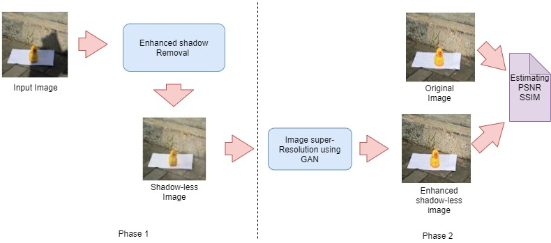

# -Enhanced-Shadow-Removal-for-Surveillance-Systems

* Shadow detection and removal is an important task when dealing with outdoor images. 
* Shadows  always trouble computer vision tasks like visual navigation, object detection and tracking.
* The field of shadow detection greatly improved compared to the shadow removal task
* To tackle the adverse effect caused by shadows , the focus is on modified Generative Adversarial Network (GAN) which can effectively remove the shadow.
* 
